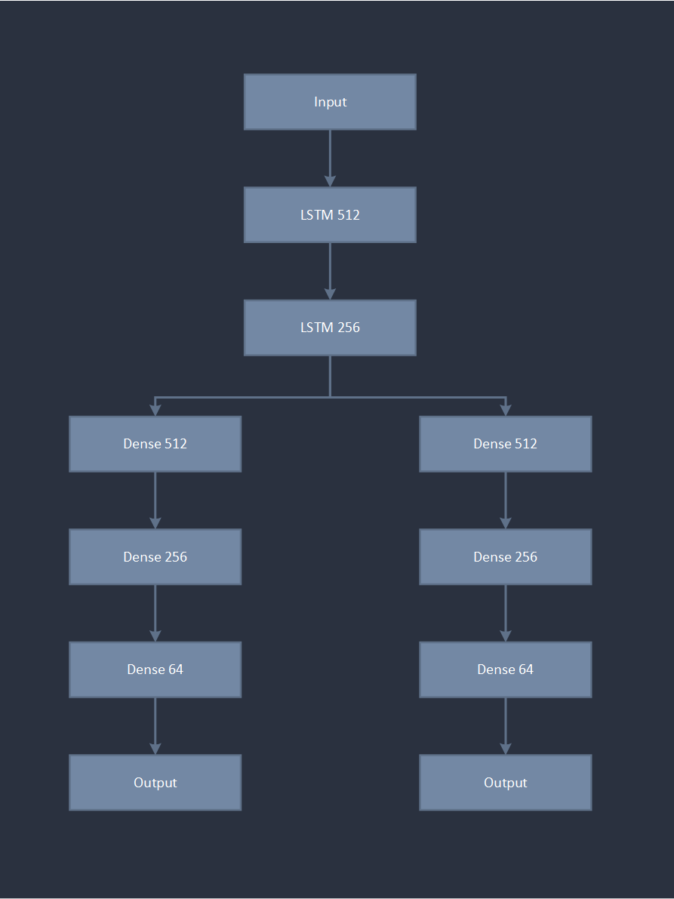
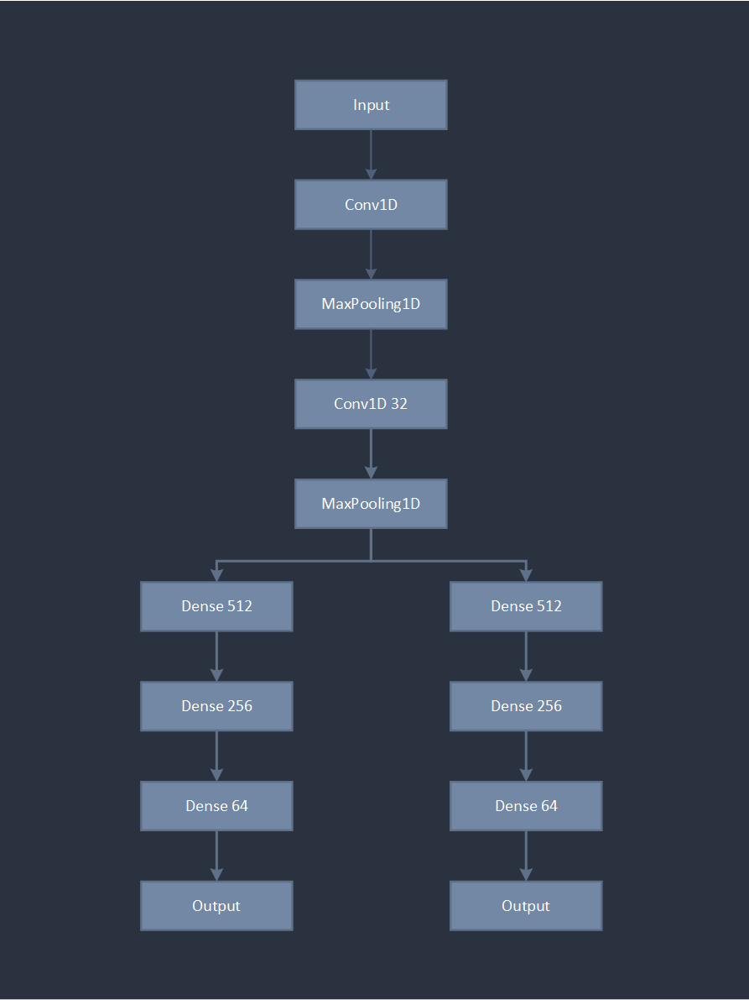
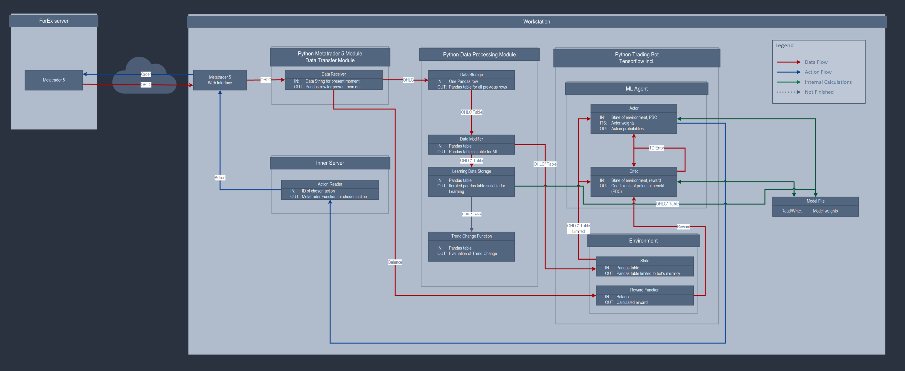

# Automatic-Trading-System-Based-on-Deep-Reinforcement-Learning

## REPOSITORY STRUCTURE

```code
├── additional  # Additional files
├── data        # Market data
├── runs        # Logs
├── src         
|   ├─ models   # Models and environments code
|   └─ utils    # Utility code (Graphs and Preprocessing)
└── README.md
```

## DESCRIPTION

The aim of this project is to develop an automatic system based on deep reinforcement learning (DRL)It enables intelligent decision-making in financial markets by training agents to perform optimal and efficient actions in the financial market environment.

## OPTIMIZATION ALGORITHMS

Currently this project uses Proximal Policy Optimisation

- Actor-Critic architecture
- Clipped surrogate objective to prevent large policy updates
- Generalized Advantage Estimation (GAE) for stable learning

## ENVIRONMENT DESIGN

- Environment:      For technical reasons the invironment is foreign exchange market
- Observations:     High, Low, Open, Close, Volume, Additional Technical Indicators, Portfolio State, Spread
- Actions:          Buy, Sell, Hold
- Reward Function:
    $x_i$ – money gained in i-th pair (buy sell)
    $y_i$ – money spent in i-th pair (buy sell)
    $α$ – ask function
    $k$ – is any currency held


$$
reward = 
\begin{cases}
(x_i -y_i)-\sum_{i_n}^{i_m} g(a)_i * const \text{ , if sold in less then bid when bought}\\
x_i - y_i \text{, if sold}\\
(g(a)_i * k) - \text{lazy punishment} \text{, if hold}
\end{cases}
$$

$$
g(a) = x_{now} - x_{i-1}
$$

$$
\text{lazy punishment} = 
\begin{cases}
\sum_{i = 0}^{memory} i+ \dfrac{spread}{memory}\\
0 \text{, if any action}
\end{cases}
$$

## MODEL ARCHITECTURE

- Shared input and hidden layers for actor and critic
- Discrete output layer for each action

LSTM             |  CNN
:-------------------------:|:-------------------------:
  |  

## WORKING LOOP



## TERMINAL INTEGRATION

- MetaTrader 5 and Metatrader 5 API are used for placing orders
- Timeframe: 1s with use of Candle by Seconds Utility

## PERFORMANCE

|Ver.|LSTM|CNN|
|----|----|---|
|model_0.9|0.07%|0.11%|
|model_0.9.1|0.23%|0.2%|

## ROADMAP

Features:
- Implement the ability to change the order size depending on the probability of prediction
- Implement risk control mechanisms
- Test other optimisation algorythms
- UI Dashboard

Improvements:
- Feature tuning
- Hyperparameter tuning

## DISCLAIMER

This project is made for research purposes.

This repository contains an early version of the project, which relies heavily on other people's research. Work is currently underway to host the latest version.
